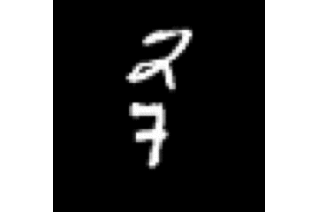

# deform-dfn
This is the implementation of dynamic deformable filter network. Parts of our code are adapted from [the tensorflow implementation of DFN](https://github.com/dbbert/dfn) and [pytorch implementation of deformable CNN] (https://github.com/ChunhuanLin/deform_conv_pytorch)

    
     
    
ground truth

    
     
    
deform-DFN (kernel size = 3)

    
     
    
deform-DFN (kernel size = 5)

    
     
    
DFN (kernel size = 9)

    
     
    
DFN (kernel size = 5)

    
     
    
DFN (kernel size = 3)

